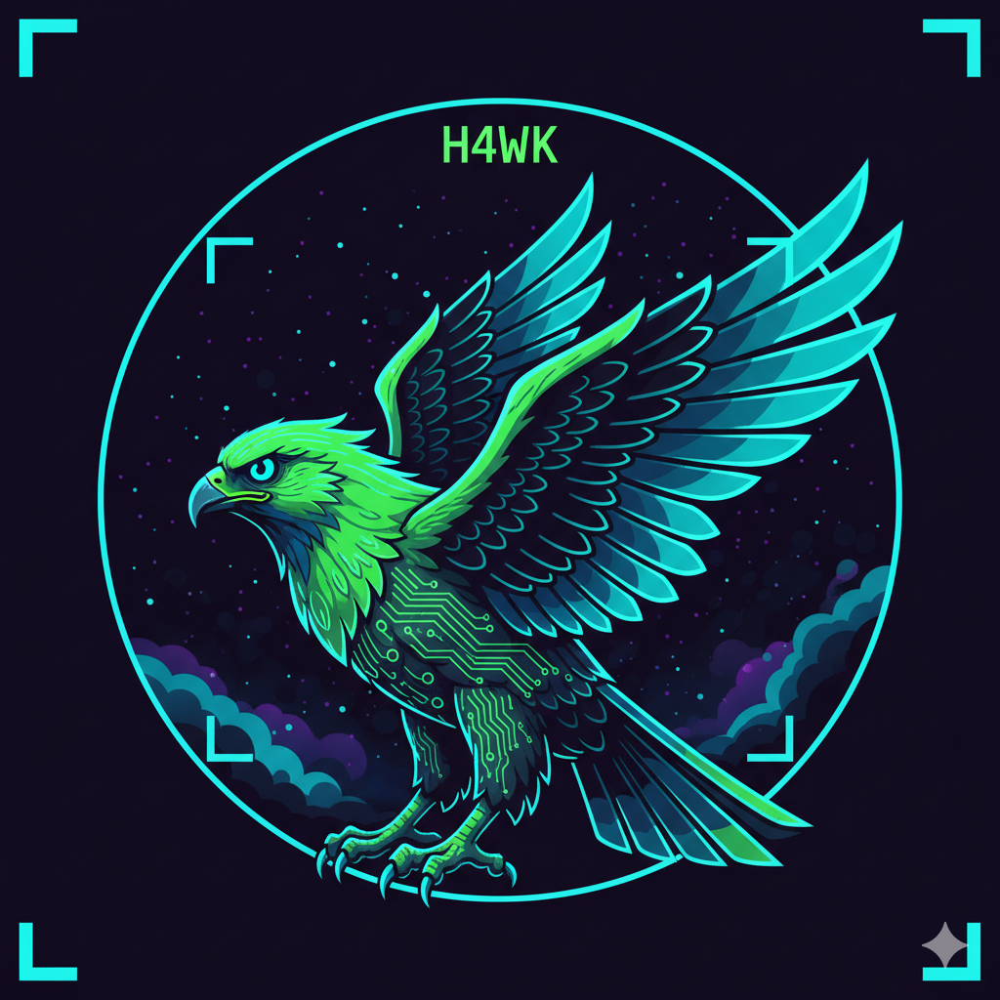

# H4WK Space Hacker Toolkit 🦅

<p align="center">
  
</p>

<p align="center">
  
  
  
</p>

**Developer & Security Toolkit + Space Hacker Theme**

Yazılım geliştiriciler, güvenlik araştırmacıları ve hacker'lar için özel olarak tasarlanmış, cyberpunk esintili Chrome extension. Tema + Developer Tools + Security Tools tek bir pakette!

## 🎨 Tasarım Konsepti

Bu tema şu elementleri birleştirir:
- 🌌 **Uzay Çağı Estetiği**: Derin uzay, nebula efektleri, yıldız alanları
- 💻 **Hacking Kültürü**: Matrix tarzı kod yağmuru, devre şemaları, HUD elementleri
- 🦅 **H4WK İmzası**: Şahin sembolü ile güç ve keskin görüşü temsil eden logo
- ⚡ **Neon Renkler**: Elektrikli yeşil, cyan ve mor tonlarında cyberpunk palet

## 🎯 Özellikler

### 🛠️ Developer Tools
- **JSON Formatter**: Otomatik JSON formatlama ve görüntüleme
- **Encoding/Decoding**: Base64, URL, Hex encode/decode
- **Hash Calculator**: MD5, SHA-1, SHA-256, SHA-512
- **Regex Tester**: Sayfa içinde regex test
- **Color Picker**: Sayfa elementlerinden renk seç
- **Quick Notes**: Hızlı not alma
- **Screenshot Tool**: Ekran görüntüsü al
- **Console Access**: Hızlı JavaScript çalıştır

### 🔒 Security Tools
- **Security Headers Check**: HTTP güvenlik header'larını kontrol et
- **Cookie Manager**: Cookie görüntüle ve yönet
- **Storage Viewer**: LocalStorage/SessionStorage görüntüle
- **SSL Certificate Info**: SSL sertifika bilgileri
- **Network Monitor**: XHR/Fetch isteklerini izle

### 📊 Page Analysis
- **Page Info**: URL, title, protocol, host bilgileri
- **Link Extractor**: Tüm linkleri çıkar
- **Image Extractor**: Tüm görselleri listele
- **Form Analyzer**: Form yapısını analiz et
- **Metadata Viewer**: Sayfa metadata'sını görüntüle

### ⌨️ Keyboard Shortcuts
- **Ctrl+Shift+H**: H4WK Toolkit'i aç
- **Alt+H**: Console'da H4WK banner'ı göster
- **Alt+J**: Sayfada JSON formatla
- **Alt+C**: URL'i kopyala

### 🎨 Tema Özellikleri
- **Renk Paleti**:
  - Neon Yeşil (#00ffaa) - Birincil
  - Cyan (#00ffff) - İkincil
  - Mor (#6600ff) - Aksan
- **Uzay Temalı Arka Plan**: 1920x1080 nebula ve yıldızlar
- **Neon Glow Efektler**: Cyberpunk tarzı parlama efektleri

### Görsel Elementler
- **🦅 Profesyonel H4WK Logosu**: AI ile oluşturulmuş, gerçekçi logo
  - Neon yeşil ve cyan renkler
  - Açık kanatlar, keskin detaylar
  - Uzay arka planı, HUD braketleri
  - Chrome icon boyutlarına optimize
- **Uzay Temalı Arka Plan**: 1920x1080 full HD arka plan görseli
- **Promotional Assets**: Badge logo ve Chrome Web Store için promo görselleri
- **Yıldız Alanları**: Animasyonlu twinkle efektli yıldızlar
- **Nebula Efektleri**: Mor ve cyan nebula ışıltıları
- **Matrix Kod Öğeleri**: Binary ve hacker tarzı kod parçacıkları
- **HUD/UI Detayları**: Köşe braketleri ve circuit node'ları
- **Tarama Çizgisi**: Sürekli hareket eden scan line animasyonu
- **Neon Glow Efektleri**: Tüm elementlerde parlama efektleri

## 📦 Kurulum

### Yöntem 1: Developer Mode (Önerilen)

1. **Depoyu İndirin**
   ```bash
   git clone https://github.com/faikkshn/H4wk-Chrome-Thame.git
   cd H4wk-Chrome-Thame
   ```

2. **PNG İkonları Oluşturun** (Gerekli)

   Profesyonel `logo.png` dosyasından Chrome icon boyutları oluşturun:

   **🦅 Yöntem A - Logo Resizer Aracı (En Kolay):**
   ```bash
   # Tarayıcınızda açın
   open tools/logo-resizer.html
   ```
   - Sayfa otomatik olarak `logo.png`'yi yükleyecek
   - 16x16, 48x48, 128x128 boyutlarında önizleme göreceksiniz
   - "Tümünü İndir" butonuna tıklayın
   - İndirilen dosyaları `icons/` klasörüne koyun

   **🔧 Yöntem B - Online Araçlar:**
   - [iloveimg.com/resize-image](https://www.iloveimg.com/resize-image)
   - `logo.png`'yi yükleyin
   - Sırayla 16x16, 48x48, 128x128 boyutlarında resize edin
   - `icons/icon16.png`, `icons/icon48.png`, `icons/icon128.png` olarak kaydedin

   **💻 Yöntem C - Komut Satırı (ImageMagick):**
   ```bash
   convert logo.png -resize 16x16 icons/icon16.png
   convert logo.png -resize 48x48 icons/icon48.png
   convert logo.png -resize 128x128 icons/icon128.png
   ```

   **📖 Detaylı Bilgi:** Tüm logo entegrasyon detayları için [LOGO_INTEGRATION.md](LOGO_INTEGRATION.md) dosyasına bakın.

3. **Chrome'da Yükleyin**
   - Chrome'u açın ve `chrome://extensions/` adresine gidin
   - Sağ üst köşedeki **"Geliştirici modu"** (Developer mode) seçeneğini aktifleştirin
   - **"Paketlenmemiş öğe yükle"** (Load unpacked) butonuna tıklayın
   - İndirdiğiniz `H4wk-Chrome-Thame` klasörünü seçin
   - Tema otomatik olarak yüklenecektir!

### Yöntem 2: Chrome Web Store (Gelecekte)
*Bu tema henüz Chrome Web Store'da yayınlanmamıştır.*

## 🖼️ Ek Özelleştirme

### Arka Plan Görselini Değiştirme

1. `images/background.svg` dosyasını düzenleyin veya kendi görselinizi ekleyin
2. Eğer PNG kullanmak istiyorsanız, SVG'yi PNG'ye çevirin:
   ```bash
   convert images/background.svg images/background.png
   ```
3. `manifest.json` dosyasında şu satırı ekleyin:
   ```json
   "theme": {
     "images": {
       "theme_ntp_background": "images/background.png"
     }
   }
   ```

### Renkleri Özelleştirme

`manifest.json` dosyasındaki `theme.colors` bölümünü düzenleyerek renkleri değiştirebilirsiniz:

```json
"colors": {
  "frame": [10, 10, 25],           // Ana pencere rengi (RGB)
  "toolbar": [15, 15, 35],          // Araç çubuğu rengi
  "tab_text": [0, 255, 170],        // Aktif sekme metin rengi
  "bookmark_text": [0, 255, 170]    // Yer imi metin rengi
}
```

## 🛠️ Geliştirici Araçları

### Önerilen Eklentiler

Bu tema ile birlikte kullanılması önerilen Chrome eklentileri:

**Yazılım Geliştirme:**
- [React Developer Tools](https://chrome.google.com/webstore/detail/react-developer-tools/fmkadmapgofadopljbjfkapdkoienihi)
- [Redux DevTools](https://chrome.google.com/webstore/detail/redux-devtools/lmhkpmbekcpmknklioeibfkpmmfibljd)
- [JSON Viewer](https://chrome.google.com/webstore/detail/json-viewer/gbmdgpbipfallnflgajpaliibnhdgobh)
- [Wappalyzer](https://chrome.google.com/webstore/detail/wappalyzer/gppongmhjkpfnbhagpmjfkannfbllamg)

**Güvenlik & Hacking:**
- [HackTools](https://chrome.google.com/webstore/detail/hack-tools/cmbndhnoonmghfofefkcccljbkdpamhi)
- [FoxyProxy](https://chrome.google.com/webstore/detail/foxyproxy-standard/gcknhkkoolaabfmlnjonogaaifnjlfnp)
- [Cookie Editor](https://chrome.google.com/webstore/detail/cookie-editor/hlkenndednhfkekhgcdicdfddnkalmdm)
- [User-Agent Switcher](https://chrome.google.com/webstore/detail/user-agent-switcher/bhchdcejhohfmigjafbampogmaanbfkg)

## 📸 Ekran Görüntüleri

*(Kurulum sonrası kendi ekran görüntülerinizi buraya ekleyebilirsiniz)*

## 🎨 Renk Referansı

| Renk | Hex | RGB | Kullanım |
|------|-----|-----|----------|
| Derin Uzay | `#05050f` | `5, 5, 15` | Ana arka plan |
| Koyu Uzay | `#0f0f23` | `15, 15, 35` | Araç çubuğu |
| Neon Yeşil | `#00ffaa` | `0, 255, 170` | Birincil vurgu |
| Cyan | `#00ffff` | `0, 255, 255` | İkincil vurgu |
| Mor | `#6600ff` | `102, 0, 255` | Aksan rengi |

## 🤝 Katkıda Bulunma

Bu projeyi geliştirmek isterseniz:

1. Bu depoyu fork edin
2. Yeni bir branch oluşturun (`git checkout -b feature/amazing-feature`)
3. Değişikliklerinizi commit edin (`git commit -m 'feat: Add amazing feature'`)
4. Branch'inizi push edin (`git push origin feature/amazing-feature`)
5. Pull Request oluşturun

## 📝 Sürüm Geçmişi

### v1.0.0 (2025-10-30)
- ✨ İlk yayın
- 🎨 Uzay temalı tasarım
- 💻 Hacking kültürü elementleri
- 🦅 H4WK logosu ve branding
- 🌈 Neon renk paleti
- 📱 Tüm Chrome sürümleri ile uyumlu

## 👨‍💻 Geliştirici

**H4WK**

- GitHub: [@faikkshn](https://github.com/faikkshn)
- Extension Deposu: [H4wk-Chrome-Thame](https://github.com/faikkshn/H4wk-Chrome-Thame)

## 📄 Lisans

Bu proje MIT lisansı altında lisanslanmıştır. Detaylar için [LICENSE](LICENSE) dosyasına bakın.

## 🙏 Teşekkürler

- Chrome DevTools ekibine
- Tüm açık kaynak katkıda bulunanlara
- Cyberpunk ve uzay temalı tasarım topluluğuna

---

**⚡ Built by H4WK**

*"Sharp vision for deep code" - H4WK*

🌌 Space Age • 💻 Hacker Culture • 🔒 Security Tools • 🦅 Developer Power

